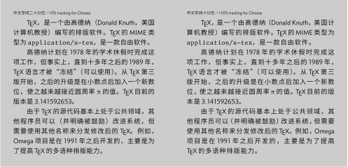

# newxeCJK

用 XeLaTeX 排版中文，首推使用
[`xeCJK`](https://github.com/CTeX-org/ctex-kit/tree/master/xeCJK)
宏包。`xeCJK` 最早由孙文昌教授开发，历史可以追溯到 2007&nbsp;年。`xeCJK`
功能丰富，对简体中文横排的支持比较完善。但 `xeCJK`
对直排的支持，或者对标点习惯不同的繁体中文、日文排版的支持都很有限。

`newxeCJK` 尝试重构 `xeCJK` 中的 inter-character token
机制，将中文/日文使用的「全形/全角」标点符号细分为
5&nbsp;类，并试图同时支持简中、繁中、日文的横排与直排。

目前 `newxeCJK` 处于研发阶段，不自动检测 XeTeX
引擎的版本是否最新，也不考虑向后兼容 `xeCJK`。希望
`newxeCJK` 提供的思路能在不久的将来成为 `xeCJK` 的一部分。

## 向用户公开的命令 / Public commands

### 字体的设置与使用

- [x] `\setCJKmainfont`, `\setCJKsansfont`, `\setCJKmonofont`
- [x] `\CJKrmfamily`, `\CJKsffamily`, `\CJKttfamily`
- [x] `\newCJKfontfamily`, `\renewCJKfontfamily`, `\provideCJKfontfamily`, `\setCJKfontfamily`
- [x] `\newCJKfontface`, `\renewCJKfontface`, `\provideCJKfontface`, `\setCJKfontface`

### 标点符号的排版样式

- [x] 全角样式：`\quanjiaostyle`
- [x] 半角样式：`\banjiaostyle`
- [x] 开明样式：`\kaimingstyle`
- [x] 不作调整：`\plainstyle`

### 本地化

- [x] 简中横排：`\ChineseSimplifiedH`
- [x] 简中直排：`\ChineseSimplifiedV`
- [x] 繁中横排：`\ChineseTraditionalH`
- [x] 繁中直排：`\ChineseTraditionalV`
- [x] 日文横排：`\JapaneseH`
- [x] 日文直排：`\JapaneseV`

### 细节控制

- [x] `\SetPunctWidthRatio{<floating point expression>}`
- [x] `\SetEndSentencePunctWidthRatio{<floating point expression>}`
- [x] `\SetPunctMinWidthRatio{<floating point expression>}`
- [x] `\SetMiddlePunctMinWidthRatio{<floating point expression>}`
- [x] `\SetPunctKernWidthRatio{<floating point expression>}`
- [x] `\SetPunctOffsetDim{<dimension expression>}`
- [x] `\SetCJKCondensedRatio{<fraction>}`

## 效果展示 / Demo

License notice

The text samples in the demo files were adapted from:

- https://zh.wikipedia.org/zh-cn/TeX
- https://zh.wikipedia.org/zh-tw/TeX
- https://ja.wikipedia.org/wiki/TeX
- https://dict.revised.moe.edu.tw/

which were licensed under various terms ([details](demo/README.md)).
Modifications to some of the text were made in order to exhibit
typographic adjustments when typesetting East Asian languages.
The demo files themselves (in SVG format) are licensed under
CC&nbsp;BY&#x2011;SA&nbsp;4.0.

本地化 / Language localization

疏排 / Tracking for CJK

标点符号一律半宽 / Half-width CJK punctuation marks

## 等待实现的功能 / TODO

- 完善 Boundary 类别和其它字符类别之间插入的 tokens
- 支持独立设置标点符号字体、日语假名字体、韩语谚文字体

## Copyright and License

The [demo files](demo), which are the non-software parts of this project,
are licensed under CC&nbsp;BY&#x2011;SA&nbsp;4.0.
The software parts of this project are licensed under LPPL&nbsp;1.3c.

    Copyright 2020-2022 Ruixi Zhang <ruixizhang42@gmail.com>
    
    This work may be distributed and/or modified under the
    conditions of the LaTeX Project Public License, either version 1.3c
    of this license or (at your option) any later version.
    The latest version of this license is in
       https://www.latex-project.org/lppl.txt
    and version 1.3c or later is part of all distributions of LaTeX
    version 2005/12/01 or later.
    
    This work has the LPPL maintenance status `maintained'.
    
    The Current Maintainer of this work is Ruixi Zhang.
    
    This work consists of the files newxeCJK.tex,
                                    README.md (this file)